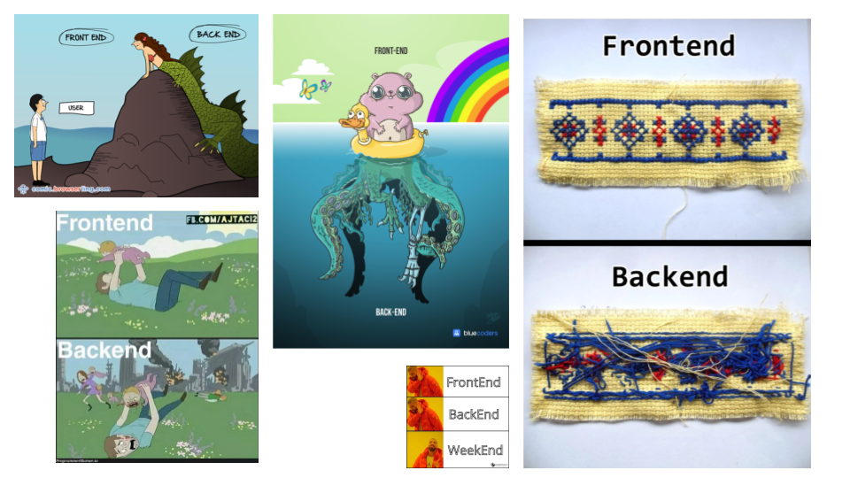

class: middle center

.small[⏳ Loading...]

---

## 👋 Hola

.left-column-66[

#### Lorenzo Peña

- From Holguín to Munich
- 15 years of Python + Django
- Django developer at Alasco

]

.right-column-33[]

---

<br/>
<br/>

# How does this URL make you feel?


--

.large[.right[😶 😬 🙄 😑 🤨 😧]]

---

class: middle center


---

class: middle

## Am I responsible for this?


---

class: middle center


---

class: middle center



---

class: middle

## This is a mirror to the soul of your code


---

class: middle

.blue[Tim Berners-Lee &mdash; Cool URIs don't change, 1998]

- Yes it's your responsibility as **Webmaster**.
- This needs thought, and organization, and commitment.
- Once you put a URL out there you should **never** break it.

.right[]

---

layout: false
class: middle center

.large[.huge[🫠]]

---

class: middle

.center.left-column[


Naming things is hard<br/>
(URLs included)

]

--

.center.right-column[


Named things evolve in time<br/>
(and so should URLs)

]

---

class: middle center

# Design as best as you can

### Break as little as possible

---

class: middle center

# Love your URLs

### Avoid 404s at all costs

???

410 gone
422 unprocessable content

---

class: middle center


???

- http to https
- auth and back
- post to get
- short urls
- analytics

---

## Status codes that will help!

--

> > .code.green.big[302_FOUND]

> > .code.green.big[301_MOVED_PERMANENTLY]

--

> > .code.green.big[307_TEMPORARY_REDIRECT]

> > .code.green.big[308_PERMANENT_REDIRECT]

---

## Status codes that should exist <br/>.small[(but don't)]

--

> > .code.green.big[309_REDIRECT_AND_REPLACE_USER_BOOKMARKS]

--

> > .code.green.big[310_RECURSION_BASE_CASE]

--

> > .code.green.big[311_NEVER_GONNA_GIVE_YOU_UP]

.right-column.right[

    

]

---

class: center


???

emoji based identity protection

--


---

class: middle center

.large[.huge[💡]]

---

layout: true

## The plan

---

.center[]

---

.center[]

---

.center[]

---

.center[]

---

layout: false
class: middle center

# Did it work?

---

class: middle center

# Did it work? .dark[YES!]

---

class: middle center

# Was it worth it?

---

class: middle center

# Was it worth it? .dark[ABSOLUTELY! 😎]

---

layout: false
class: middle center

## The art of .emph[not redirecting]

.big.orange.bold[or how to design URLs]

---

## Basic principles

--

.left-column.center[]

--

.right-column.center[]

---

## Readable

--

People will read them, some will even type them by memory.

<br/>

.box.what[/u/d/1/c/~q/page]
.box.nice[/user/profile]

---

## Predictable

--

People should be able to guess-navigate your site by rewriting URLs.

<br/>

.box.nice[/user/profile/]
.box.nice[/user/settings/]
.box.nice[/user/security/]

---

## Concise

--

Straight to the point, no redundancy.

<br/>

.box.what[/user/user-settings/security-settings]
.box.nice[/user/settings/security]

---

## Complete

--

Every part must lead to somewhere, or at least redirect to somewhere else.

<br/>

.box.nice[/user/settings/security]
.box.look[/user/settings]
.box.nice[/user]

---

## Consistent

--

Single language, single style.

<br/>

.box.what[/current_user/Seguridad/multi-factorAuth]
.box.nice[/current-user/security/multi-factor-auth]

---

## Beautiful

--

What is beautiful?

<br/>

.box.nice[/this_style/is_beautiful/]
.box.nice[/this-one/as-well]
.box.nice[/beauty/isInTheEye/ofTheBeholder]

---

## At least not ugly

--

<br/>

.box.look[/avoid/file_extensions.aspxyz]
.box.look[/if-possible?queryParamBasedNavigation=too]
.box.what[/django-docs/have/strong,words,for,you]

---

layout: false
class: middle center

# Love your URLs

---

layout: false
class: middle center

## The art of .emph[redirecting]

.big.orange.bold[or how avoid 404s at all costs]

---

## django.contrib.redirects

--

.center.huge[🔋]

> Stores redirects in a **database** and handles the redirecting via middleware. Uses the HTTP response status code 301.

.right[]

---

class: middle center

.large[.huge[🤓]]

---

## Redirecting from old to new

--

```python
urlpatterns = [
    path("", include("path.to.old.urls")),
    path("", include("path.to.new.urls")),
]
```

---

## Redirecting from old to new

```python
urlpatterns = [
    path("", include("path.to.old.urls", namespace="old_urls")),
    path("", include("path.to.new.urls")),
]
```

--

|            |                                                              |
| ---------- | ------------------------------------------------------------ |
| .red[old]  | `/estimating/cost_element_budgets/project/1/budget_history/` |
|            | .red[`old_urls:budget_history`]                              |
| .blue[new] | `/costs/project/1/budget/history/`                           |
|            | .blue[`budget_history`]                                      |

---

layout: true

## A middleware

---

.tasklist[

A middleware to redirect from old to new.

]

---

.tasklist[

.strike[A middleware to redirect from old to new.]

]

.codewip[

```python
def redirect_middleware(get_response):

    def middleware(request):
        response = get_response(request)

        if new := should_go_to_new(request, response)
            return redirect(new, permanent=True)

        return response

    return middleware
```

]

---

.tasklist[

.strike[A middleware to redirect from old to new.]

A "should go to new" function.

]

.codewip[

```python
def redirect_middleware(get_response):

    def middleware(request):
        response = get_response(request)

        if new := `should_go_to_new(request, response)`
            return redirect(new, permanent=True)

        return response

    return middleware
```

]

---

.tasklist[

.strike[A middleware to redirect from old to new.]

A "should go to new" function.

A modified "redirect" shortcut.

]

.codewip[

```python
def redirect_middleware(get_response):

    def middleware(request):
        response = get_response(request)

        if new := should_go_to_new(request, response)
            return `redirect(new, permanent=True)`

        return response

    return middleware
```

]

---

.tasklist[

.strike[A middleware to redirect from old to new.]

A "should go to new" function.

.strike[A modified "redirect" shortcut.]

]

.codewip[

```python
def redirect_middleware(get_response):

    def middleware(request):
        response = get_response(request)

        if new := should_go_to_new(request, response)
            return redirect(new, permanent=True)

        return response

    return middleware
```

]

---

layout: true

## A "should go to new" function

---

.tasklist[

A "should go to new" function.

]

---

.tasklist[

.strike[A "should go to new" function.]

]

.codewip[

```python
def should_go_to_new(request, response):
    if we_want_to_handle(response) and is_old_url(request):
        return find_new_url(request)

    return None

```

]

---

.tasklist[

.strike[A "should go to new" function.]

Do we want to handle?

]

.codewip[

```python
def should_go_to_new(request, response):
    if `we_want_to_handle(response)` and is_old_url(request):
        return find_new_url(request)

    return None

```

]

---

.tasklist[

.strike[A "should go to new" function.]

Do we want to handle?

Is old URL?

]

.codewip[

```python
def should_go_to_new(request, response):
    if we_want_to_handle(response) and `is_old_url(request)`:
        return find_new_url(request)

    return None

```

]

---

.tasklist[

.strike[A "should go to new" function.]

Do we want to handle?

Is old URL?

A "find new url" function.

]

.codewip[

```python
def should_go_to_new(request, response):
    if we_want_to_handle(response) and is_old_url(request):
        return `find_new_url(request)`

    return None

```

]

---

layout: true

## Do we want to handle?

---

.tasklist[

Do we want to handle?

Is old URL?

A "find new url" function.

]

.codewip[

```python
REDIRECT_CODES = [301, 302, 307, 308]


def we_want_to_handle(response):
    return (
        not expensive_to_compute(response)
        and response.status_code not in REDIRECT_CODES
    )
```

]

---

layout: true

## Is old URL?

---

.tasklist[

.strike[Do we want to handle?]

Id old URL?

A "find new url" function.

]

.codewip[

```python
def is_old_url(request):
    resolver_match = request.resolver_match

    return "old_urls" in resolver_match.namespaces
```

]

---

layout: true

## Find new URL!

---

.tasklist[

.strike[Do we want to handle?]

.strike[Id old URL?]

A "find new url" function.

]

.codewip[

```python
def find_new_url(request):
    resolver_match = request.resolver_match

    try:
        return reverse(
            resolver_match.url_name,
            args=resolver_match.args,
            kwargs=resolver_match.kwargs
        )
    except NoReverseMatch:
        logger.warning("🚧")
```

]

---

.tasklist[

.strike[Do we want to handle?]

.strike[Id old URL?]

.strike[A "find new url" function.]

]

.codewip[

```python
def find_new_url(request):
    resolver_match = request.resolver_match

    try:
        return reverse(
            resolver_match.url_name,
            args=resolver_match.args,
            kwargs=resolver_match.kwargs
        ) `+ "?..."`
    `except NoReverseMatch:`
        logger.warning("🚧")
```

]

---

layout: false
class: middle

.center.left-column[


]

.center.right-column[


]

---

## Path

```python
path(
    "users/<int:pk>/",
    UserDetailView.as_view(),
    name="user_detail",
)
```

---

## Path with old

```python
path_with_old(
    "users/<int:pk>/",
    UserDetailView.as_view(),
    name="user_detail",
    old=[
        "users/<int:pk>/data/",
        "users/<int:pk>/auth/",
        "users/<int:pk>/consents/",
    ],
)
```

---

layout: true

## Here we go again: "path with old"

---

---

```python
def path_with_old(route, view, kwargs=None, name=None, `*, old=None`):
    return path(route, view, kwargs, name)
```

---

```python
def path_with_old(route, view, kwargs=None, name=None, `*, old=None`):
    paths = [path(route, view, kwargs, name)]

    return paths[0]
```

---

```python
def path_with_old(route, view, kwargs=None, name=None, `*, old=None`):
    paths = [path(route, view, kwargs, name)]

    if name and old:
        # Redirect all "old" to "route" using "name"
        ...

    return paths[0]
```

---

```python
def path_with_old(route, view, kwargs=None, name=None, `*, old=None`):
    paths = [path(route, view, kwargs, name)]

    if name and old:
        # Redirect all "old" to "route" using "name"
        ...

    return path("", include(paths)) if len(paths) > 1 else paths[0]
```

---

```python
def path_with_old(route, view, kwargs=None, name=None, *, old=None):
    paths = [path(route, view, kwargs, name)]

    if name and old:
        redirect_view = `get_redirect_view(name)`

        for old_path in old:
            paths.append(
                path(old_path, redirect_view, kwargs)
            )

    return path("", include(paths)) if len(paths) > 1 else paths[0]
```

---

layout: true

## A redirect view on-the-fly

---

---

```python
def get_redirect_view(`name`):

    def redirect_view_on_the_fly(request, *args, **kwargs):
        # Actually redirect
        ...


    return redirect_view_on_the_fly
```

---

```python
def get_redirect_view(name):

    def redirect_view_on_the_fly(request, *args, **kwargs):
        resolver_match = request.resolver_match

        full_name = ":".join([*resolver_match.namespaces, name])
        return redirect(full_name, *args, **kwargs, permanent=True)

    return redirect_view_on_the_fly
```

--

.box[😉 Don't forget query parameters]

---

layout:false
class: middle center

.large[.huge[🎩]]

---

layout: false
class: middle center

#### Design as best as you can <br/> Break as little as possible

---

class: middle center

# The art of (not) redirecting

---

## Thank you!

You can find me here:

.left-column-66[

| X                                                       | GitHub                                                        |
| ------------------------------------------------------- | ------------------------------------------------------------- |
| .center[] | .center[] |

.right[Slides are here 👉]
.right.small[(and this link will hopefully not break)]
]

.right-column-33[

<br/>


]

---

class: middle center


